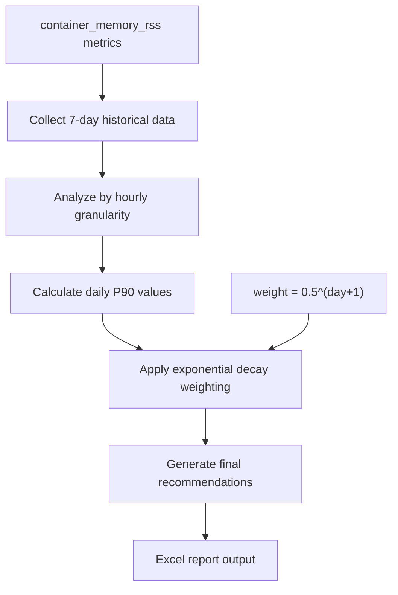

# 🎯 Kubernetes Resources Recommend

[](https://golang.org/)
[](LICENSE)
[]()

> 🚀 Intelligent Memory Resource Recommendation System for Kubernetes Deployments based on Prometheus Monitoring Data

## 🌍 Language / 语言

- **English** (Current)
- **[中文](README-zh.md)** 

## ✨ Features

🔍 **Intelligent Analysis** - Deep analysis based on 7 days of memory usage data  
📊 **Scientific Algorithm** - Precise recommendations using P90 values and exponential decay weighting  
🏢 **Multi-tenant Support** - Support for independent analysis across multiple namespaces  
⚡ **High Performance** - Concurrent processing for dramatically improved analysis efficiency  
📑 **Friendly Reports** - Export beautiful Excel format analysis reports  
🔍 **Current vs Recommended** - Compare current resource configuration with AI recommendations  
📈 **Optimization Insights** - Clear visibility into resource savings and optimization potential  

## 🎯 Scope of Recommendations

> ⚠️ **Important Note**: This tool currently **provides Memory resource recommendations only**

### 💾 Why Memory Resources Only?

**Memory - Non-compressible Resource**  
- 🚨 **Strict Limits** - When container memory usage exceeds limits, Kubernetes immediately terminates (OOMKilled) the Pod
- 📈 **Accurate Prediction** - Memory usage patterns are relatively stable, historical data has good predictive value
- ⚖️ **Critical Balance** - Setting too low causes frequent OOM, setting too high wastes resources
- 🎯 **Precise Control** - Requires precise recommendations based on real usage data

**CPU - Compressible Resource (Not recommended yet)**  
- 🔄 **Compressible** - When CPU resources are insufficient, containers are throttled but not killed
- 📊 **Complex Patterns** - CPU usage is affected by business peaks, concurrency and other factors, making prediction complex
- 🌊 **Dynamic Adjustment** - Kubernetes HPA can automatically scale based on CPU utilization

## 📁 Project Structure

```
kubernetes-resources-recommend/
├── 📂 cmd/kubernetes-resources-recommend/   # 🚪 Main program entry
│   └── main.go
├── 📂 internal/                            # 🔒 Internal packages, not exposed externally
│   ├── 📂 exporter/                        # 📊 Export functionality
│   │   └── excel.go
│   ├── 📂 prometheus/                      # 📈 Prometheus client
│   │   ├── client.go
│   │   └── metrics.go
│   ├── 📂 recommender/                     # 🧠 Recommendation algorithm core
│   │   └── recommender.go
│   └── 📂 types/                          # 📋 Type definitions
│       ├── prometheus.go
│       └── recommendation.go
├── 📂 pkg/                                # 📦 Public packages
│   └── 📂 config/                         # ⚙️ Configuration management
│       ├── config.go
│       └── errors.go
├── 🔧 Makefile                           # 🛠️ Build scripts
├── 📄 go.mod & go.sum                    # 📚 Dependency management
└── 📖 README.md                          # 📝 Project documentation
```

## 🚀 Quick Start

### 📦 Installation

```bash
# Clone the project
git clone https://github.com/luozijian1990/kubernetes-resources-recommend.git
cd kubernetes-resources-recommend

# Install dependencies
go mod download
```

### 🔨 Build

```bash
# Using Makefile (recommended)
make build

# Or manual build
go build -o bin/kubernetes-resources-recommend cmd/kubernetes-resources-recommend/main.go

# Cross-platform build
make build-all
```

### 💡 Usage Examples

```bash
# Basic usage
./bin/kubernetes-resources-recommend \
  -prometheusUrl="https://prometheus.your-domain.com" \
  -checkNamespace="production" \
  -limits=1.5

# Using Makefile to run
make run ARGS="-prometheusUrl=https://prometheus.example.com -checkNamespace=staging"
```

### 📋 Parameter Description

| Parameter | Type | Default | Description |
|-----------|------|---------|-------------|
| `-prometheusUrl` | string | `https://prometheus.example.com` | 🌐 Prometheus server address |
| `-checkNamespace` | string | `default` | 🏷️ Kubernetes namespace to analyze |
| `-limits` | float64 | `1.5` | 📏 Memory limit multiplier relative to request |

## 🧮 Memory Recommendation Algorithm

Our intelligent memory resource recommendation algorithm is based on the following steps:



**Algorithm Details:**

1. **📈 Data Collection** - Analyze memory usage data from the past 7 days
2. **⏱️ Fine Granularity** - Collect `container_memory_rss` metrics hourly
3. **📊 Statistical Analysis** - Calculate daily P90 values (excluding anomalous peaks)
4. **⚖️ Intelligent Weighting** - Apply exponential decay weighting: `weight = 0.5^(day+1)`
5. **🎯 Final Calculation** - Weighted sum to get recommended memory request values
6. **🛡️ Safety Margin** - Memory limit = Memory request × limits multiplier

## 📊 Output Reports

The program generates an Excel file named `{namespace}-resource-recommend.xlsx`:

> 📝 **Note**: Current version includes **Memory resource recommendations only**

### 📋 Report Field Description

| Column | Description | Example | Notes |
|--------|-------------|---------|-------|
| 🏷️ Namespace | Kubernetes namespace | `production` | K8s namespace |
| 🚀 Deployment | Deployment name | `web-server` | Deployment resource name |
| 📦 Container | Container name | `app-container` | Container name |
| 📊 Current Request (MB) | Current memory request | `1024` | Current configuration |
| 📊 Current Limit (MB) | Current memory limit | `2048` | Current configuration |
| 💾 Recommended Request (MB) | Recommended memory request | `512` | Based on 7-day P90 algorithm |
| 🛡️ Recommended Limit (MB) | Recommended memory limit | `768` | Request × limits multiplier |
| 📈 Request Optimization (MB) | Memory request savings | `512` | Current - Recommended |
| 📈 Limit Optimization (MB) | Memory limit savings | `1280` | Current - Recommended |
| 📊 Request Optimization (%) | Request savings percentage | `50.0%` | Optimization percentage |
| 📊 Limit Optimization (%) | Limit savings percentage | `62.5%` | Optimization percentage |

### 📈 Excel Output Example

Generated Excel file structure:

```
Resource Recommendations.xlsx
┌─────────────┬─────────────┬─────────────┬─────────────┬─────────────┬─────────────┬─────────────┬─────────────┬─────────────┬─────────────┬─────────────┐
│  Namespace  │ Deployment  │  Container  │Cur Req (MB) │Cur Lmt (MB) │Rec Req (MB) │Rec Lmt (MB) │Req Opt (MB) │Lmt Opt (MB) │Req Opt (%)  │Lmt Opt (%)  │
├─────────────┼─────────────┼─────────────┼─────────────┼─────────────┼─────────────┼─────────────┼─────────────┼─────────────┼─────────────┼─────────────┤
│ production  │ web-server  │    nginx    │     512     │     1024    │     256     │     384     │     256     │     640     │   50.0%     │   62.5%     │
│ production  │ web-server  │     app     │    1024     │     2048    │     512     │     768     │     512     │    1280     │   50.0%     │   62.5%     │
│ production  │ api-gateway │   gateway   │     256     │     512     │     128     │     192     │     128     │     320     │   50.0%     │   62.5%     │
│ production  │    redis    │    redis    │     128     │     256     │      64     │      96     │      64     │     160     │   50.0%     │   62.5%     │
└─────────────┴─────────────┴─────────────┴─────────────┴─────────────┴─────────────┴─────────────┴─────────────┴─────────────┴─────────────┴─────────────┘

📊 Optimization Summary Statistics
┌─────────────────────────┬─────────────────┬─────────────────┬─────────────────┬─────────────────┐
│        Metric           │ Current Config  │ Recommended     │ Optimization    │ Optimization %  │
├─────────────────────────┼─────────────────┼─────────────────┼─────────────────┼─────────────────┤
│ Total Containers        │       4         │                 │                 │                 │
│ Memory Request (MB)     │     1920        │      960        │      960        │     50.0%       │
│ Memory Limit (MB)       │     3840        │     1440        │     2400        │     62.5%       │
└─────────────────────────┴─────────────────┴─────────────────┴─────────────────┴─────────────────┘
```

### 📊 Report Features

- **🎨 Beautiful Formatting** - Header styling and automatic column width adjustment
- **📈 Complete Data** - Contains all analyzed Deployments and Containers
- **🔍 Easy Filtering** - Supports Excel filtering and sorting functionality
- **📝 Clear Identification** - Clear column names and unit identification
- **🎨 Color Coding** - Green for savings, red for increases needed
- **📊 Summary Statistics** - Overall optimization statistics and container count

### 🎯 Real Usage Scenario

**Generate Report Example:**
```bash
$ ./bin/kubernetes-resources-recommend -checkNamespace=production -limits=1.5
2024/01/15 10:30:00 Starting Kubernetes resource recommendation
2024/01/15 10:30:01 All required metrics are available
2024/01/15 10:30:01 Generating memory recommendations...
2024/01/15 10:30:05 Processed namespace: production, deployment: web-server, container: nginx
2024/01/15 10:30:08 Processed namespace: production, deployment: web-server, container: app
2024/01/15 10:30:10 Processed namespace: production, deployment: api-gateway, container: gateway
2024/01/15 10:30:12 Generated 6 recommendations
2024/01/15 10:30:12 Recommendations exported to production-resource-recommend.xlsx
2024/01/15 10:30:12 Process completed in 12.5s
```

**Generated Files:**
- 📄 `production-resource-recommend.xlsx` - Contains detailed resource recommendation data
- 📊 Formatted Excel spreadsheet, ready for direct use in resource configuration updates

## 🔧 Development Guide

### 🛠️ Available Commands

```bash
make help          # 📖 View all available commands
make build         # 🔨 Build project
make test          # 🧪 Run tests
make test-coverage # 📊 Run tests and generate coverage report
make fmt           # 🎨 Format code
make lint          # 🔍 Code inspection
make clean         # 🧹 Clean build artifacts
```

### 📋 System Requirements

- **Go Version**: 1.23.9+ 
- **Prometheus**: Requires kube-state-metrics installation
- **Kubernetes**: Cluster environment (for obtaining monitoring metrics)

### 📈 Required Prometheus Metrics

Ensure your Prometheus instance collects the following metrics:

| Metric Name | Description | Source |
|-------------|-------------|--------|
| `container_memory_rss` | Container memory usage | cAdvisor |
| `kube_pod_owner` | Pod owner information | kube-state-metrics |
| `kube_replicaset_owner` | ReplicaSet owner information | kube-state-metrics |
| `kube_deployment_created` | Deployment creation time | kube-state-metrics |
| `kube_deployment_spec_replicas` | Deployment replica specifications | kube-state-metrics |
| `kube_pod_container_resource_requests` | Container resource requests | kube-state-metrics |
| `kube_pod_container_resource_limits` | Container resource limits | kube-state-metrics |

## 🤝 Contributing

We welcome all forms of contributions! Please check [CONTRIBUTING.md](CONTRIBUTING.md) for detailed information.

### 🐛 Issue Reporting

If you find bugs or have feature suggestions, please [create an Issue](https://github.com/luozijian1990/kubernetes-resources-recommend/issues).

## 📄 License

This project is open sourced under the MIT license. Please see the [LICENSE](LICENSE) file for details.

## 🙏 Acknowledgments

- [Prometheus](https://prometheus.io/) - Powerful monitoring system
- [excelize](https://github.com/qax-os/excelize) - Excel file processing library
- [kube-state-metrics](https://github.com/kubernetes/kube-state-metrics) - Kubernetes metrics exporter

---

<div align="center">

**If this project helps you, please give us a ⭐ Star!**

Made with ❤️ by [luozijian1990](https://github.com/luozijian1990)

</div>
